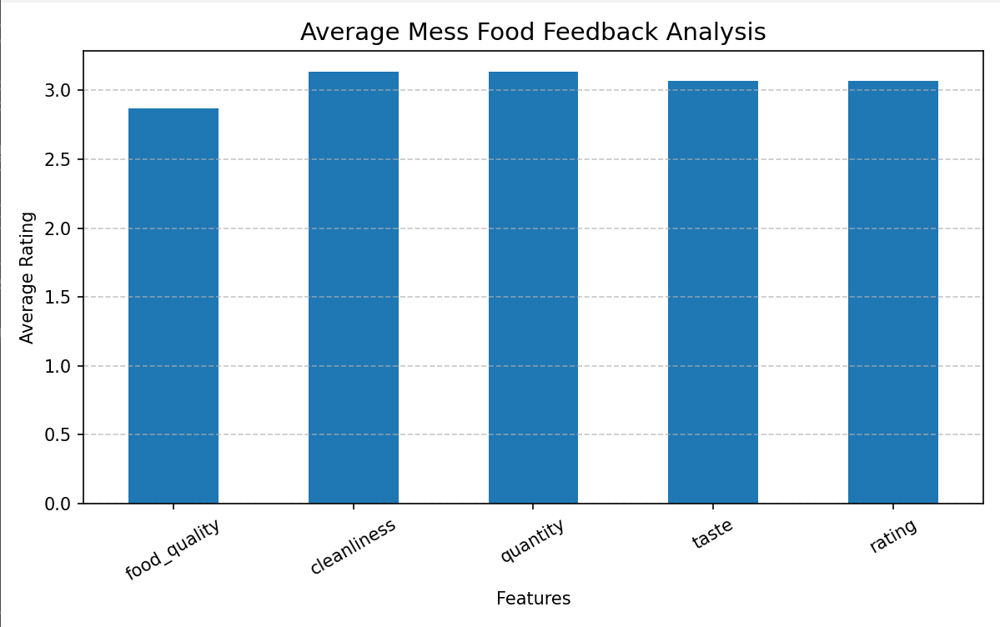

## Problem Statement
Mess food quality varies daily, and students often face inconsistency in food quality, cleanliness, and taste.

## Objective
To analyze and predict mess food ratings using machine learning based on different factors.

### 🧩 Project Structure
```
MESS-FOOD-FEEDBACK-ANALYZER/
├── Project_Report.pdf
├── README.md
├── analysis.py
├── data/   
│   ├── mess_data.csv
├── model/ 
│   ├── train_model.py
│   └── model.pkl
├── app.py
├── Linear Regression Visualization Error Fromula.png
├── Analysis.png

```

## Model Used
Linear Regression

## How Linear Regression Works
Linear Regression finds the best-fit line between input and output variables.

Formula : 
   ```
   y = mx + c
   ```

Where:
- y = Predicted value
- m = Slope
- x = Input feature
- c = Intercept
 
## Linear Regression Visualization
The model tries to minimize the error between actual and predicted values.

### Error Formula :

<p align="center">
  
</p>

## Analysis of Mess_data.csv
<p align="center">
  
</p>

## Parameters Used
- Food Quality
- Cleanliness
- Quantity
- Taste

## Technologies Used

| Technology        | Purpose              |
| ----------------- | -------------------- |
| Python            | Core Programming     |
| Pandas            | Data Handling        |
| Matplotlib        | Data Visualization   |
| Scikit-learn      | Machine Learning     |

## Features
- Data preprocessing
- Model training
- Prediction system
- Visualization graphs
- Analytics support

## How to Run
1. Install dependencies:
   ```
   pip install pandas scikit-learn matplotlib
   ```

2. Run training:
   ```
   python model/train_model.py
   ```

3. Run analysis:
   ```
   python analysis.py
   ```

## Contribution
Contributions are welcome.
- Fork the repository
- Create a new branch
- Commit changes
- Open a Pull Request

## Output
- Model predicts rating based on inputs
- Graph visualization of feedback
